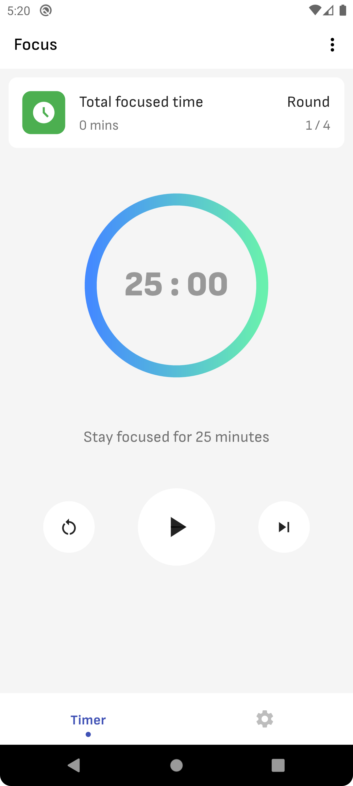
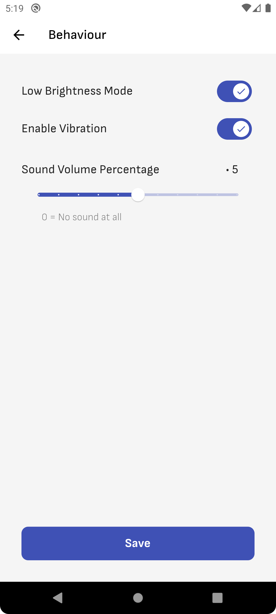
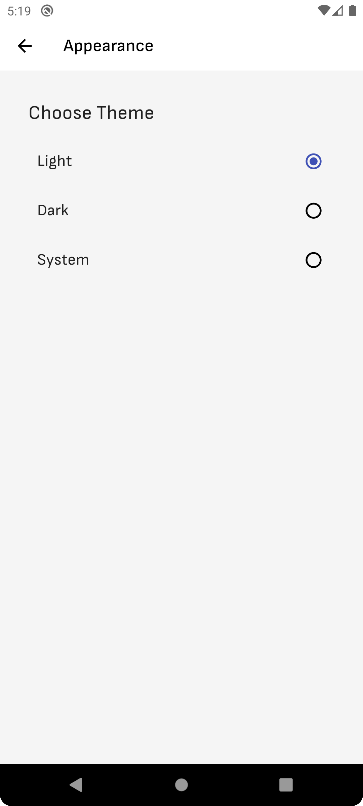
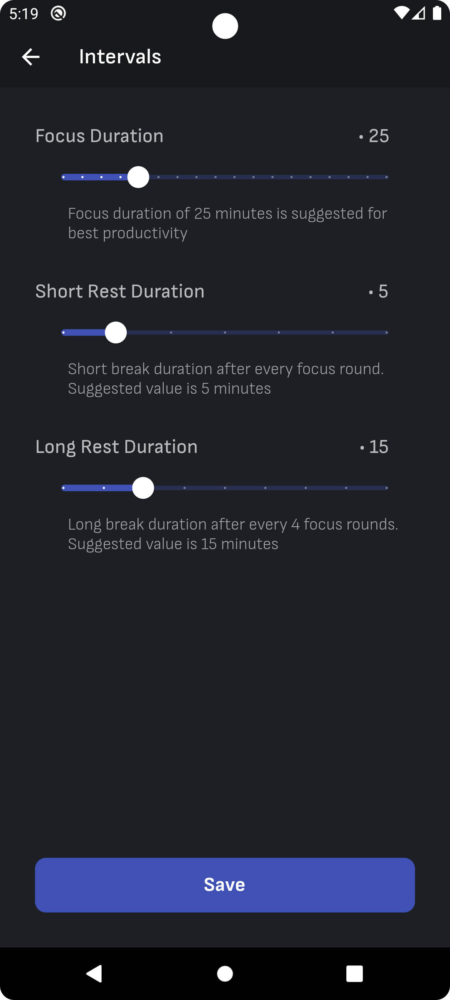
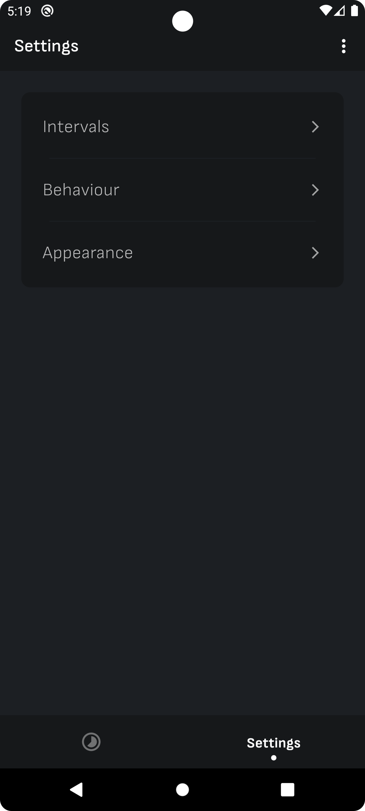

# What is Focus Timer app?

The secret to effective time management is...thinking in tomatoes (minutes) rather than hours? It may seem silly at first, but millions of people swear by the life-changing power to the Pomodoro Technique. ( Pomodoro is Italian for tomato. 🍅 )

This App helps you break your task into small fragments. It helps you to take a break after every 25 minutes so that you can focus for a longer time. Breaks help you stay focused for longer periods.

## Installation

#### Download from Play Store:

<a href="https://play.google.com/store/apps/details?id=com.mmstq.pomo.pomodoro" target="_blank">
  
  <a/>

## Screenshots

   &nbsp;&nbsp;&nbsp;  &nbsp;&nbsp;&nbsp; 

   &nbsp;&nbsp;&nbsp; 

## Insights
1. State Management = **Provider**
2. Used custom painter to draw custom shapes
3. Published on **Play Store**

## License

[MIT](https://choosealicense.com/licenses/mit/)

